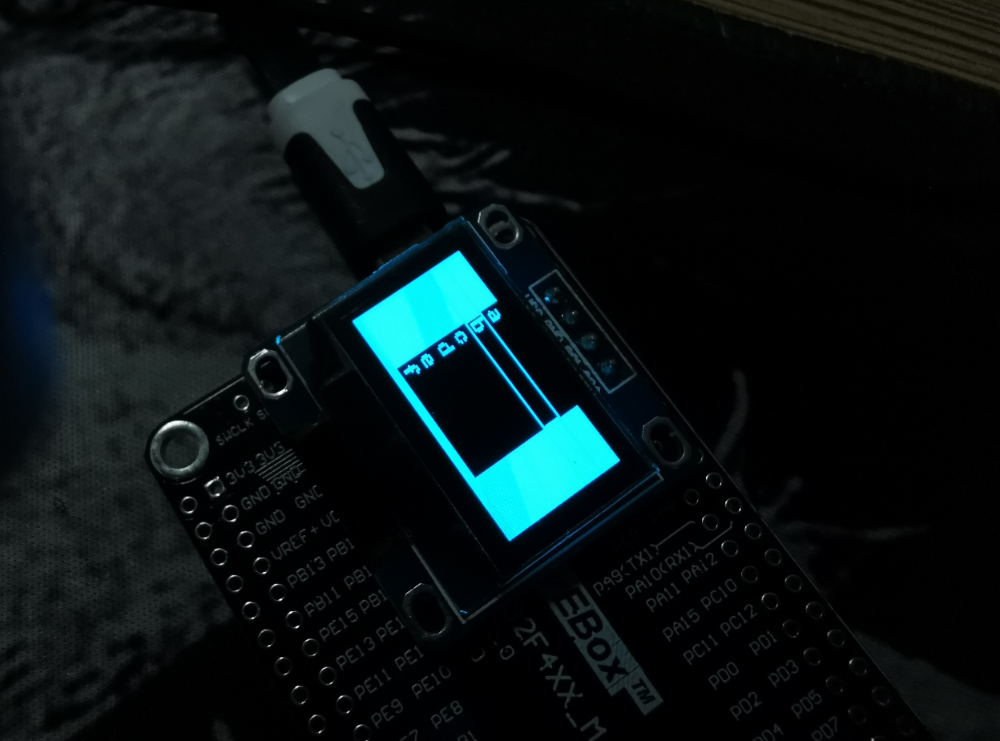

**Note: this repo is developing**

# Micropython Easy Menu



##usage

** simple example is update. You can see it in the repo

1. init a menu object
```python
m=menu.menu(ssd1306object,0,0,128,64)
```
2. init a menu text list, The first element is the text to display, and the second element is arg offset is use to display middle parts of the menu.
```python
menutext=[['menuText1','print("this is the menuText1")'],['menuText2','print("this is the menuText2")']]
m.initText
```
3. When your Device detects  Events, use `m.moveUp()`,`m.moveDown()` or `m.click()` to control menu bar.